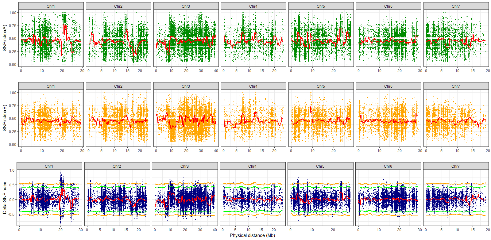

BSA_plot
=========

## A high-quality drawing program to show BSA result

### Installation

**BSA_plot** is a R project which required ggplot2 and gridExtra:

```r
> install.packages("ggplot2")
> install.packages("gridExtra")
> library("ggplot2")
> library("gridExtra")
```

---

The format of input datas(BSA_*.txt) are as follows:

```r

POS	VALUE	CHROM
0	0.4765	Chr1
0.05	0.4765	Chr1
0.1	0.4760	Chr1
0.15	0.4748	Chr1
0.2	0.4832	Chr1
0.25	0.4822	Chr1
0.3	0.4722	Chr1

```

As the example datasets, the first column is position(Mb) of SNP, the second column is the value of BSA_index, the third column is the CHROM.  
And BSA_AP\BP.txt represents the SNP-index of Mutant\WT pool, while BSA_DP.txt represents the Delta-SNPindex.  BSA_AL\BL\DL.txt are Sliding window results of SNP-index.  BSA_*99\95.txt are 99% or 95% threshholds data.

---
### BSA plot

<p align="center">
<a href="https://github.com/WMBio/BSA_plot/tree/master/Figure/Figure1.png">

</a>
</p>

